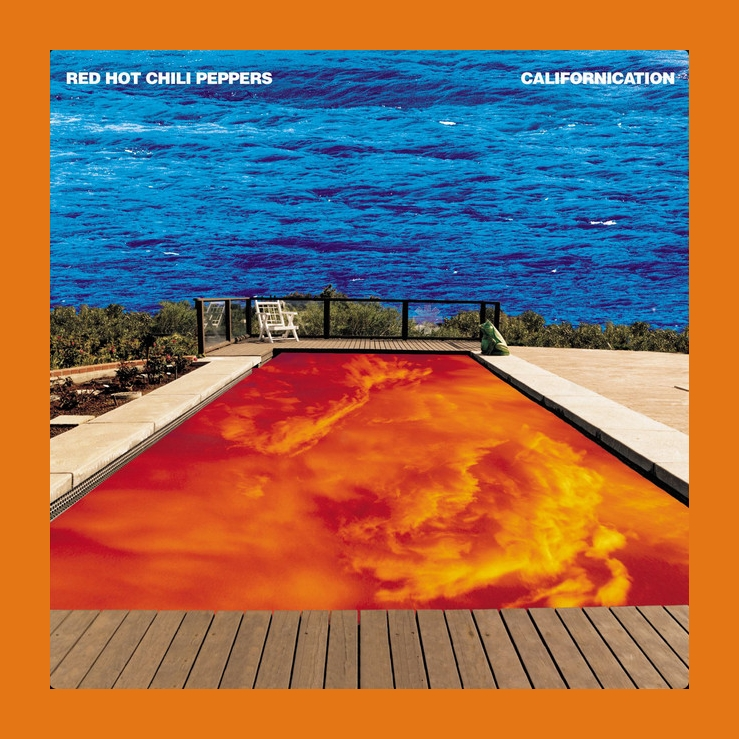
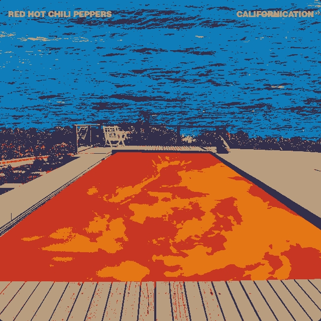

# Color Glow Extractor

A simple tool to extract the color glow from images or videos. This process happens behind the scenes of platforms like **Spotify**, **Apple Music**, **YouTube**, and I was curious to see how it works.

This project lets you explore how platforms create dynamic backgrounds by extracting the dominant color from images or videos. The extracted colors are used to generate **smooth gradient-like effects**, which can be applied in UI design or synced with devices like **LED strips** for immersive experiences.

**Check out the live demo [here](https://glow-extractor.streamlit.app/).**

## Examples

### Images

<table>
  <tr>
    <td>
    
Glowed Image

    </td>
    <td>
    
Clustered Image

    </td>
  </tr>
  <tr>
    <td>
    
Glowed Image

    </td>
    <td>
    
Clustered Image

    </td>
  </tr>
</table>

## Technologies Used

- OpenCV — Image processing
- K-Means Clustering — Color extraction
- Hasler and Süsstrunk's algorithm — Colorfulness metric
- Streamlit — Web app

## Useful Applications

- **UI Design**: Create dynamic backgrounds for websites or applications.
- **LED Strips**: Sync the extracted colors with LED strips for immersive experiences.
- **IoT Devices**: Use the extracted colors to control smart devices like light bulbs or speakers.

## Acknowledgments

- [Hasler and Süsstrunk's algorithm](https://www.researchgate.net/publication/243135534_Measuring_Colourfulness_in_Natural_Images)
- For more information about linking IoT devices, check out [this GitHub repository](https://github.com/davidkrantz/Colorfy)
